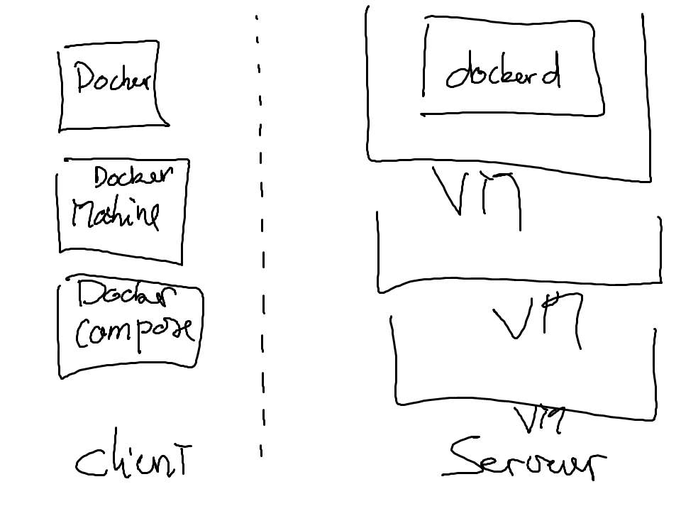

# Docker


## Mon premier script docker

* La commande `run`

```
$ docker run hello-world
```


# Services




## Les commandes `Docker`

* run: lancer le container

* ps: afficher les taches des containers

* images: cf images ISO


## Creer ma premiere base de donnees

[MYSQL.md](./MYSQL.md)
