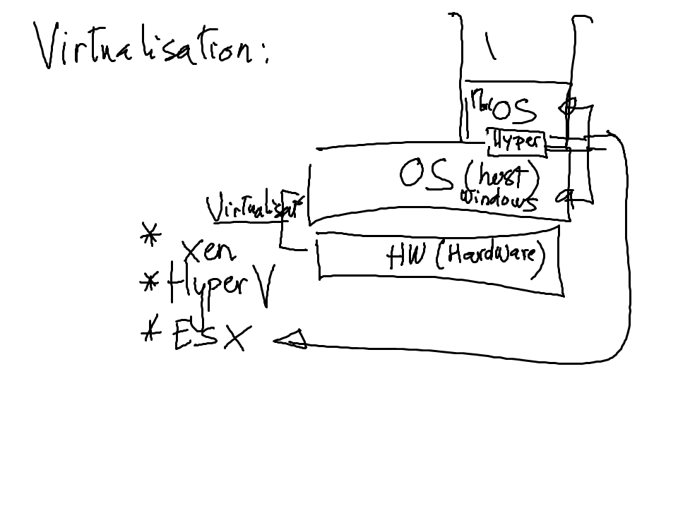
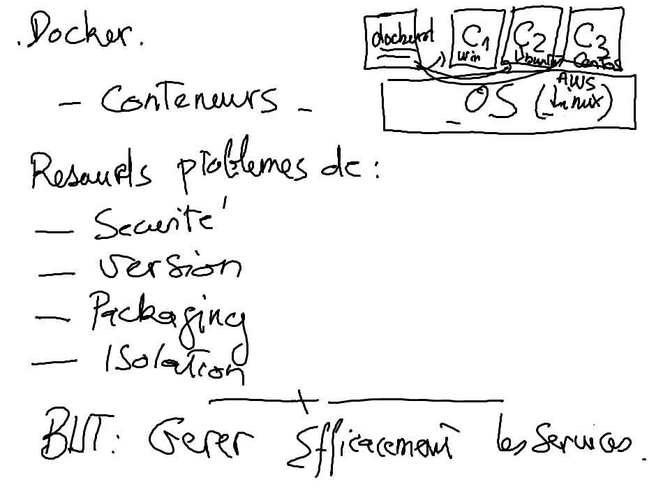

# Docker

## Installer docker

https://www.docker.com/community-edition

## Virtualisation

## HyperVisor de type 1 et 2 sont utilises

Note: nous ne rentrerons pas dans les details

* VirtualBox: de type 1

* Hyper-V de type 2

## Conteneurs

