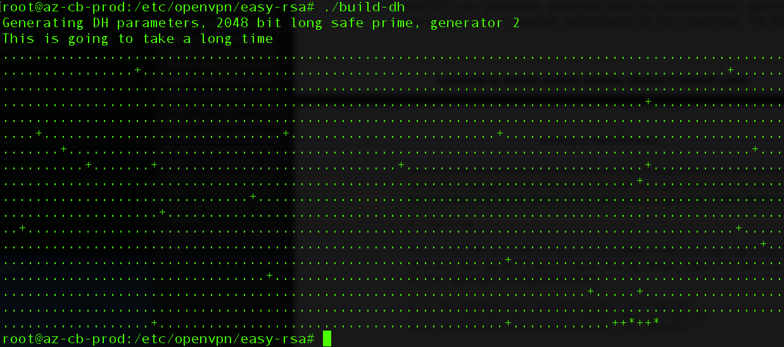
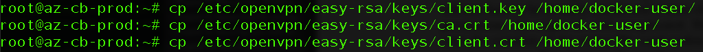
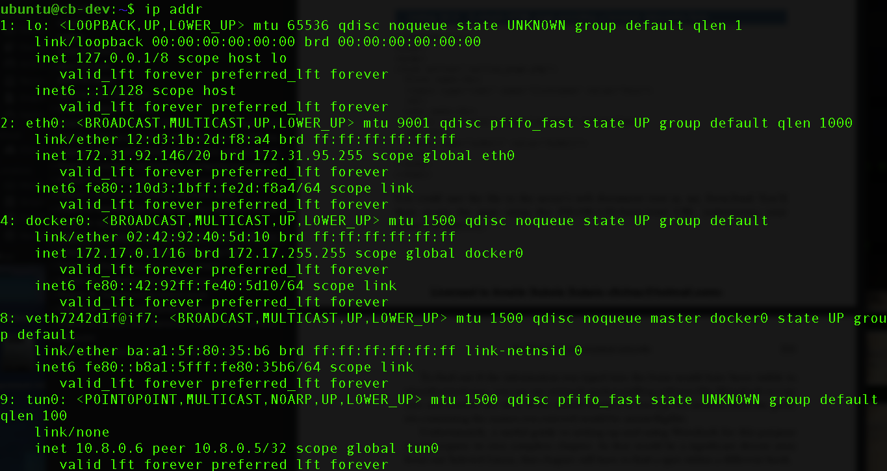

## Introduction sur le VPN
Le VPN (Virtual Private Network) sert à pouvoir accéder à Internet en toute sécurité depuis votre ordinateur lorsque vous êtes connecté à un réseau non sécurisé et permet de traverser ces réseaux non approuvés de manière sécurisée. Le VPN dissimule souvent votre adresse IP réelle, il entraînera presque certainement l'obtention d'une adresse IP différente, il protégera les données que vous transférez via le WiFi public et permet de masquer notre position actuelle. Par exemple, avec le VPN, les utilisateurs peuvent choisir le pays d'origine de leur connexion Internet.

## Prérequis pour installer un VPN :warning:
:small_red_triangle: Avoir au moins deux machines génériques (containers) à votre disposition. Un pour jouer le rôle du serveur (pour moi par exemple, az-cb-prod) et une pour jouer le rôle du client (cb-dev). 
:small_red_triangle: Je vous suggère d'ouvrir plusieurs fenêtre terminal (au moins 3) pour pouvoir se connecter avec deux d'entres elles sur les deux machines en question (az-cb-prod & cb-dev) et puis l'autre fenêtre servira à faire les commandes qui suivent.

:triangular_flag_on_post: Petite parenthèse: Tout au long de mon projet, je devais changer de prompt pour donner la permission à certaines de mes commandes de pouvoir s'exécuter. C'est donc avec le ```sudo -i``` que je peux faire cela (prompt #).

## Commençons !
:one: SSH. Activez le serveur et le client en utilisant la commande SSH. Par exemple, voici la commande que j'ai fais pour partir mon serveur (az-cb-prod) et mon client (cb-dev) sur deux terminaux différents:
```
$ docker-machine ssh az-cb-prod
$ docker-machine ssh cb-dev
```
:two: Sur le serveur az-cb-prod ET sur le client cb-dev, nous allons commencer par installer OpenVPN en utilisant la commande ```apt```. Nous installerons également le package easy-rsa, ce qui nous aidera à configurer une autorité de certification interne à utiliser avec notre VPN. 
```
$ sudo apt-get update
$ sudo apt-get install openvpn easy-rsa
```
:three: Activer sur le serveur un pare-feu qui bloque tous les ports autres que 22 (SSH) et 1194 (le port OpenVPN par défaut). Remarqué que le prompt est rendu #, cela veut dire qu'il fallait être "rooté" pour pouvoir faire ces commandes (avoir une permission spéciale).
```
# ufw enable
# ufw allow 22
# ufw allow 1194
```
:four: Toujours sur le serveur, il faut aller suprimer une ligne qui se trouve dans le fichier ```sysctl.conf```. Cela va permettre le routage interne entre les interfaces réseau sur le serveur. Lorsque vous allez être dans le répertoir, il sera indiqué quelle ligne suprimer. Pour commencer, il faut se mettre en mode "root", car sinon vous ne serait pas en mesure de pouvoir faire des changements dans la page et puis entrer dans /etc/ en fesant "cd".
```
# nano /etc/sysctl.conf
```
:five: Pour charger le nouveau paramètre, exécutez sysctl -p.
```
# sysctl -p
```
:ok: L'environnement serveur est maintenant configuré et prêt à générer les clés serveur. Voici les prochaines étapes à suivre:

:one: Lorsque nous avons installé OpenVpn, un répertoir /etc/openvpn c'est créé automatiquement. Ils viennent avec des configurations de bases qui faudra changer avec nos propres informations. Voici les commandes à faire:
```
# cp -r /usr/share/easy-rsa/ /etc/openvpn
# nano /etc/sysctl.conf
```


:two: Il faut supprimer tout ce qui se trouve dans le répertoir /etc/openvpn/easy-rsa pour pouvoir regénérer de nouvelles clés. D'abord entrer dans le répertoir puis faire la commande . . vars
```
$ cd /etc/openvpn/easy-rsa/
$ . . vars
```


:three: L'étape suivante est d'exécuter ```clean-all``` suivi de ```build-ca```, qui utilise le script pkitool qui crée le certificat "root". Il faudra confirmer les paramètres d’identification fournis précedement dans vars.
```
# ./clean-all
# ./build-ca
```


:four: Générer ensuite le certificat du serveur et nos clés, ainsi que certains fichiers supplémentaires utilisés pendant le processus de cryptage.
```
# ./build-key-server server
```
:five: Il faut générer quelques autres éléments, dont une clé Diffie-Hellman(DH) puissante à utiliser lors de l'échange de clé en tapant:
```
# ./build-dh
```


:six: Les clés seront maintenant écrites dans le répertoire /etc/openvpn/easy-rsa/keys/, mais OpenVPN ne le sait pas. Par défaut, OpenVPN les recherchera dans / etc / openvpn /, il faut dont les copiez comme ceci:
```
# cp /etc/openvpn/easy-rsa/keys/server* /etc/openvpn
# cp /etc/openvpn/easy-rsa/keys/dh2048.pem /etc/openvpn
# cp /etc/openvpn/easy-rsa/keys/ca.crt /etc/openvpn
```


:no_entry_sign: Le serveur est presque prêt. Juste avant de passer au client, il faut générer les clés clients en restant dans le même répertoir que nous étions, soit dans le serveur /etc/openvpn/easy-rsa/:
```
# ./pkitool client
```


:small_red_triangle_down: Les deux fichiers client, ainsi que le fichier ca.crt original qui se trouve toujours dans le répertoire /keys/ devront maintenant être transférés en toute sécurité sur le client. Pour ce faire, il faut ouvrir une nouvelle fenêtre terminal et puis les copier sur le bureau de votre ordinateur dans un nouveau fichier(par exemple, keys). 

Voici les commandes à faire pour copier les clés:
```
# cp /etc/openvpn/easy-rsa/keys/client.key /home/docker-user/
# cp /etc/openvpn/easy-rsa/keys/ca.crt /home/docker-user/
# cp /etc/openvpn/easy-rsa/keys/client.crt /home/docker-user/
```


& ensuite les copiers sur le bureau de l'ordinateur:


:ok: Maintenant, il faut aller s'assurer que le répertoir ```server.conf``` est bien configuré en fesant cette commande:
```
#  zcat \
 /usr/share/doc/openvpn/examples/sample-config-files/server.conf.gz \
 > /etc/openvpn/server.conf
```
Et puis, entrer dans le répertoir ```/etc/openvpn/``` et faire la commande ```$ sudo nano server.conf``` et aller modifier les paramètres qui si trouvent et les rendres exactement comme ceci:
```
port 1194
# TCP or UDP server?
proto tcp
;proto udp
;dev tap
dev tun
ca ca.crt
cert server.crt
key server.key  # This file should be kept secret
dh dh2048.pem
server 10.8.0.0 255.255.255.0
ifconfig-pool-persist ipp.txt
push "route 10.0.3.0 255.255.255.0"
keepalive 10 120
comp-lzo
port-share localhost 80
user nobody
group nogroup
persist-key
persist-tun
status openvpn-status.log
log openvpn.log
;log-append  openvpn.log
verb 3
```
:raised_hands: Pour terminer avec le client, il faut seulement faire la commande:
```
$ systemctl start openvpn
```
& pour voir si le openvpn est actif, voici la commande à faire:
```
$ systemctl status openvpn
```

Comme vous le voyez, le openvpn est actif et "running". Donc, nous pouvons passer du côté client.

:one: Il faut copier le fichier /client.conf vers le répertoir /etc/openvpn/ que l'installation du début a créé.
```
$ cp /usr/share/doc/openvpn/examples/sample-config-files/client.conf \
 /etc/openvpn/
```
:two: Entrer dans le répertoir /etc/openvpn/ et aller dans le fichier client.conf et s'assurer que vous voyez exactement ceci:
```
client
;dev tap
dev tun
proto tcp
remote 192.168.1.23 1194
resolv-retry infinite
nobind
user nobody
group nogroup
persist-key
persist-tun
ca ca.crt
cert client.crt
key client.key
comp-lzo
verb 3
remote-cert-tls server
```
:three: Vous pouvez maintenant accéder au répertoire / etc / openvpn / et extraire ces clés de certification du serveur. Remplacez l’adresse IP ou le nom de domaine de votre serveur:
```
# scp docker-user@az-cb-prod:/home/docker-user/ca.crt .
# scp docker-user@az-cb-prod:/home/docker-user/client.crt .
# scp docker-user@az-cb-prod:/home/docker-user/client.key .
```

:four: Pour pouvoir ouvrir le tunnel du client au serveur, il faut faire la commande suivante, sans toucher au terminal par la suite:
```
$ openvpn --tls-client --config /etc/openvpn/client.conf
```

:five: Et finalement, aller dans le terminal "client" ET "serveur" et faire la commande: 
```
$ ip addr
```


:exclamation: Comme vous pouvez voir, la dernière ligne #9 sur le client et la dernière ligne #10 sur le serveur montre que le tunnel a été créé! Pour voir si nous pouvons nous connecter du client au serveur, il suffit de faire un ping sur le terminal client cb-dev avec l'adresse LOCAL du serveur az-cb-prod que le VPN a créé pour le tunnel:


:heavy_check_mark: Dernière étape, tester le VPN en fesant la commande suivante:
```
$ curl 10.8.0.1:4200
```
Et voici le résultat final! Vous pouvez vous connecter à distance grâce au VPN! 


