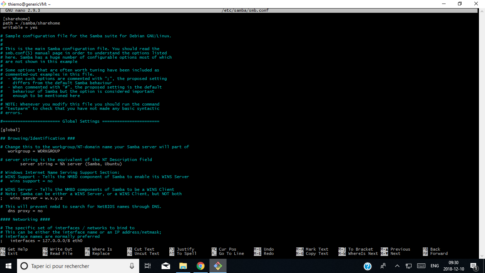
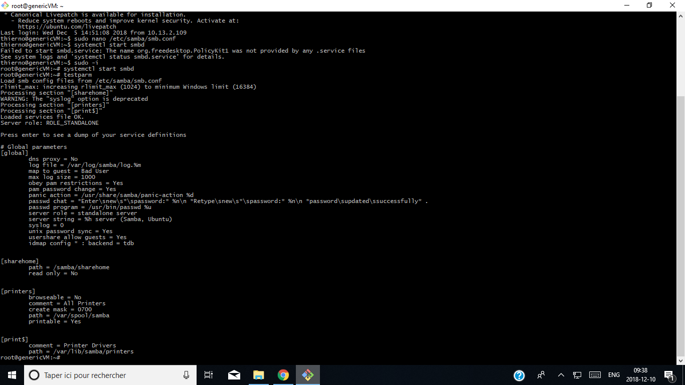
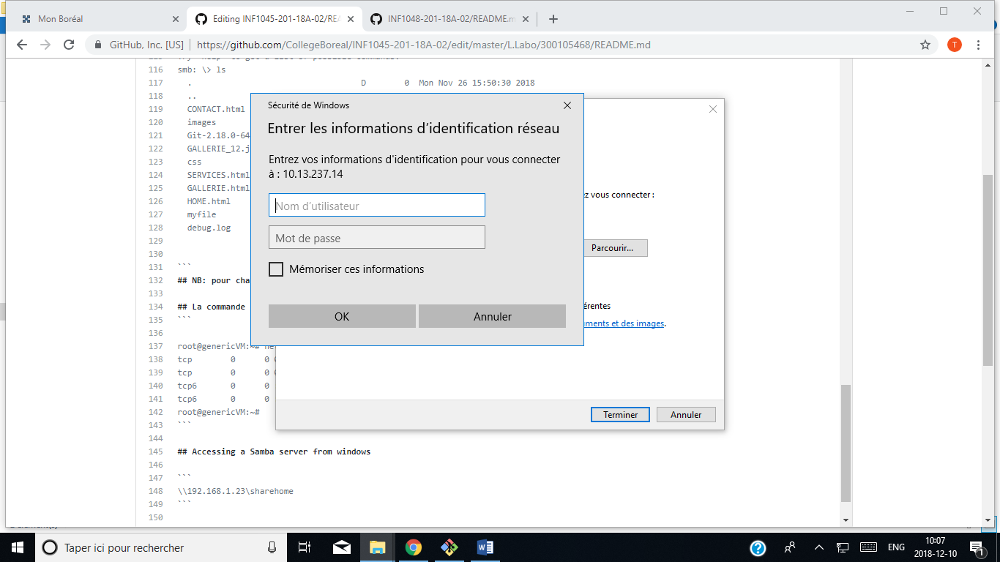
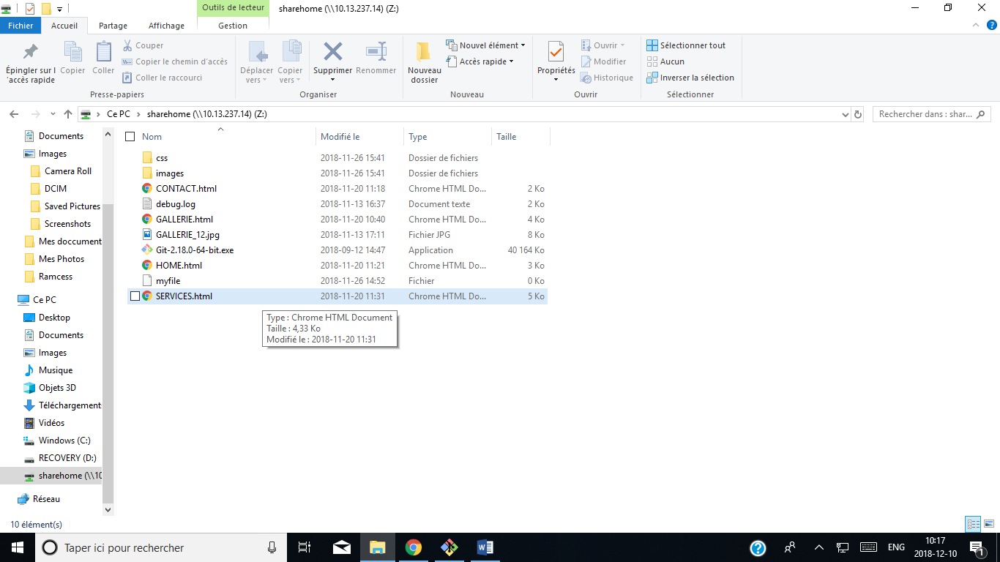

## 🔎SAMBA SERVER

## 📍INTRODUCTION
Avec SAMBA vous allez mettre en place un service de partage de disque pour des clients réseau. Ceux-ci peuvent être sous Linux ou sous Windows. Nous verrons surtout la configuration du service serveur sous Linux, et la configuration des clients sous Windows.

Samba est un produit assez populaire. Il existe de plus en plus d'outils de configuration en environnement graphique qui simplifient les tâches sur un serveur en exploitation (partage de ressources, création de comptes utilisateurs). Comme nous n'en sommes pas là, nous allons réaliser les opérations manuellement.

## 📍Eléments d'installation et de configuration de SAMBA
SAMBA est installé avec le paquet fds-network sur Kubuntu Dapper. Si vous n'utilisez pas le paquet fds-network, installez les paquets manuellement. Il ne devrait normalement pas y avoir de problèmes de dépendances.

Le paquet installe principalement samba et samba-common :

* le programme nmbd qui assure la résolution de nom NetBIOS et smbd qui assure le partage de ressource SMB/CIFS dans /usr/sbin,

* le script d'initialisation dans /etc/init.d,

* un fichier de configuration /etc/samba/smb.conf,

* une documentation complète dans /usr/share/doc,

* le service de journalisation (log) dans /var/log/samba,

* des outils comme smbpasswd pour la création des comptes samba et nmblookup pour vérifier le fonctionnement de la résolution de noms NetBIOS.

La commande dpkg-reconfigure samba vous demande si samba doit être lancé en mode autonome, choisissez « oui », si un fichier /etc/samba/smbpasswd doit être créé, choisissez également « oui ». La dernière option vous permet d'avoir une base de données de compte créée automatiquement à partir de la base de compte du fichier /etc/passwd.
Faites tout de suite une sauvegarde du fichier /etc/smb.conf.

## 📍Le fichier de configuration sous Linux
Voici le fichier de configuration qui nous servira de base de travail. Il va permettre de :

définir NomDuServeur comme serveur Samba,

mettre en place l'authentification des utilisateurs.

## 📍Les étapes de la configuration du serveur
Nous allons réaliser les opérations suivantes :

* Vérifier et valider le fichier de configuration,

* Déclarer les ressources partagées,

* Créer des comptes utilisateurs pour SAMBA.

Il n'y aura plus qu'à tester la configuration à partir d'un client.

Attention, un compte système n'est pas un compte SAMBA. Faites bien la distinction entre les deux.

partager des disques et une imprimante pour un client Windows,

partager le dossier personnel d'un utilisateur sous Linux comme étant son répertoire personnel sous Windows.

Le fichier de configuration comprend essentiellement deux parties :

* une partie “ générale ” qui définit le comportement général du serveur et la stratégie adoptée pour les services communs (CPD, mode d'authentification, service WINS)...

* une partie share, qui définit les ressources partagées et les permissions d'accès.
 ## ✨étape I - Configuration du fichier smb.conf
Configurer l'environnement de samba par le fichier /etc/samba/smb.conf et demarrez le service avec la commande /etc/init.d/samba start ou restart. Cette opération doit être réalisée chaque fois que le fichier de configuration est modifié. Vérifiez la configuration à l'aide de la commande testparm | more.

Corrigez les erreurs éventuelles de configuration.
## ✨étape II - Déclarer les ressources partagées
Cette opération est réalisée dans la partie Share Definitions du fichier smb.conf. Chaque fois que vous ajoutez ou modifiez une ressource, relancez le service serveur.
Fichier de configuration d'un serveur SAMBA :

## 🔎CRÉATION D'UTILISATEUR SAMBA 
Rappel: les comptes doivent déjà être créés sous linux avec la commande adduser .

Pour créer les comptes Samba, il faut utiliser la commande:

```  
  #adduser sambauer
  #smbpasswd -a sambauser
  ```
       
Cette commande ajoute le compte SAMBA MonCompte avec le mot de passe MonMotDePasse.

Il est possible ensuite dans la section "Share définitions" d'ajouter des partages accessibles seulement à certains utilisateurs par exemple pour le répertoire /samba/sharehome :

 ```
 #mkdir -p/samba/sharehome
 #touch/samba/sharehome/myfile  
 #chmod 777 /samba/sharehome
```
## Configuration du fichier smb.conf
```
# nano /etc/samba/smb.config
```


## La Commande systemctl
```
# systemctl start smbd
# systemctl enable smbd
```
## Tester la Configuration Samba
```
# testparm
```


## Puis la commande Su Sambauser
Après avoir lancé la commande dans git bash, il vous presentera une extention et en vous demandant le mot de passe que vous aviez utiliser lors de la création du compte Sanba.
```
thierno@genericVM:~$ su sambauser
Password:xxxxxxxxxxxx
sambauser@genericVM:/home/thierno$ 

```
## La commande smbclient //localhost/sharehome

```
sambauser@genericVM:/home/thierno$ smbclient //localhost/sharehome
WARNING: The "syslog" option is deprecated
Enter WORKGROUP\sambauser's password:
Try "help" to get a list of possible commands.
smb: \> ls
  .                                   D        0  Mon Nov 26 15:50:30 2018
  ..                                  D        0  Mon Nov 19 14:47:38 2018
  CONTACT.html                        A     1121  Tue Nov 20 11:18:51 2018
  images                              D        0  Mon Nov 26 15:41:36 2018
  Git-2.18.0-64-bit.exe               A 41126928  Wed Sep 12 14:47:56 2018
  GALLERIE_12.jpg                     A     8057  Tue Nov 13 17:11:42 2018
  css                                 D        0  Mon Nov 26 15:41:33 2018
  SERVICES.html                       A     4436  Tue Nov 20 11:31:41 2018
  GALLERIE.html                       A     4053  Tue Nov 20 10:40:43 2018
  HOME.html                           A     3010  Tue Nov 20 11:21:09 2018
  myfile                              N        0  Mon Nov 26 14:52:11 2018
  debug.log                           A     1292  Tue Nov 13 16:37:24 2018

                280142704 blocks of size 1024. 139034556 blocks available
```
## NB: pour changer $ en # on utilise la commande sudo -i

## La commande netstat -tulpn | egrep smbd
```

root@genericVM:~# netstat -tulpn | egrep smbd
tcp        0      0 0.0.0.0:445             0.0.0.0:*               LISTEN      9481/smbd
tcp        0      0 0.0.0.0:139             0.0.0.0:*               LISTEN      9481/smbd
tcp6       0      0 :::445                  :::*                    LISTEN      9481/smbd
tcp6       0      0 :::139                  :::*                    LISTEN      9481/smbd
root@genericVM:~#
```

## Accessing a Samba server from windows

```
\\10.13.237.14\sharehome
```

 
 ## Puis
 
 
 
### Et Voilà
  
  
 
 


