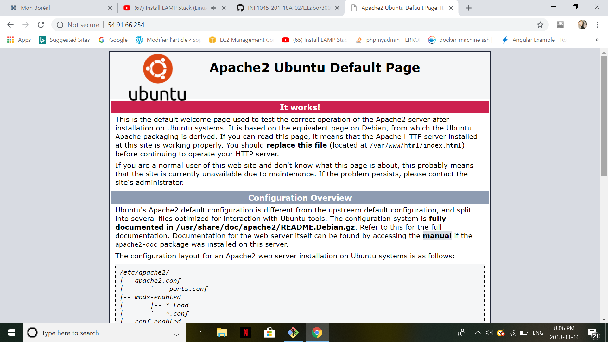

# Building a MediaWiki server

 MediaWiki est un excellent moyen d’illustrer le processus de construction d’un
serveur Web (souvent appelé serveur LAMP) sous Linux.
# Statique ou Dinamique SiteWeb??

Le serveur LAMP est une configuration Linux si commune qu’Ubuntu. Le caret (^) à la fin de cet exemple identifie le
cible comme un paquet spécial regroupé
 
 ```
$ sudo apt install lamp-server^
```

Cette commande, après vous avoir demandé de créer un mot de passe de base de données, automatiquement
déposez un serveur Web actif sur votre système, ne laissant rien à faire
en plus de créer du contenu de site Web. Diriger votre navigateur Web vers l’IP du serveur
address devrait afficher une page d'accueil créée lors de l'installation d'Apache.
### Mais Attention ! 

Mais l’automatisation n’est pas toujours la meilleure solution. Parfois, vous aurez envie de personnaliser
votre pile de logiciels en spécifiant des versions particulières pour assurer l'application
compatibilité, ou en substituant un paquet à un autre (MariaDB sur MySQL, pour
exemple, comme vous le verrez bientôt).

C'est pourquoi j'ai décidé de vous montrer comment le configurer manuellement.
### SSH :
comme vous connaissez, vous avez le choix d'ou vous pouvez installer votre Wiki si C'est dans votre serveur (genericVM)
voici la commande :
```
$ ssh name@10.13.237.10.X 
```
Et si vous aves le choix de l'installer sur votre machine virtuelle (CB-DEV) vous devez utilisez cette commande :
```
$ docker-machinne ssh CB-DEV
```

# Steps:

Voici une liste de ce que vous devez faire pour atteindre votre objectif:
1 Installez Apache
2 Installez le langage de script PHP(7.0.0) côté serveur.
3 Installez un moteur SQL (mysql dans ce cas)
4 Installer et configurer MediaWiki

# 1st step : Install Apache2 

Le serveur HTTP open source Apache tend à dominer
le marché des serveurs Web sur toutes les plateformes. Parce qu’il est si populaire, et malgré le
fait qu'Apache a de sérieux concurrents, dont Nginx (également multiplate-forme) et le
IIS (qui fonctionne exclusivement sur les serveurs Windows).
Alors, O Commence!

```
$ sudo apt update
$ sudo apt install apache2

```
L’URL que vous utiliserez pour accéder à un site Apache exécuté sur votre poste de travail.
est localhost. Si, à la place, vous avez choisi de travailler sur un conteneur LXC ou Virtual
Box VM, vous utiliserez l’adresse IP de la machine pour l’URL.


 # 2nd step : Install PHP
 
PHP (langage de script) est un outil qui peut être
utilisé pour écrire vos propres applications web. Les applications PHP prédéfinies sont souvent utilisées par
des applications tierces telles que MediaWiki pour accéder à des ressources système et les traiter. Ses
sûr de supposer, donc, que vous aurez besoin du P dans votre serveur LAMP.
 
 ```
$ sudo apt install php
$ sudo apt install libapache2-mod-php

```
vous pouvez changer aussi le fichier mais il faust recommencer Apache2 

```
$ sudo /etc/init.d/apache2 restart
$ sudo nano var/www/html/test.php
```
vous pouvez ecrire une simple paragraphe afin de tester le php 

```
<?php> echo 'IT WOKRS'; ?>
```
et vous pouvez le tester avec l URL de localhost/test.php

# 3rd Step : Install Mysql

A cette etape vous devez configurer le password de votre conteneur mysql

```
$ sudo apt install mysql-server
```


Acceder a votre conteneur

```
$ mysql -u root -p
```
```
mysql> CREATE DATABASE wiki;
mysql> SHOW DATABASES;
mysql> exit
```
# 4rd Step : Installer et configurer MediaWiki

Premierment, il faut telecharger le pqauet de MediaWiki que tu peux le faire avec ce siteweb (www.mediawiki.org/wiki/Download) ou bien avec  la commande suivante :
```
$ wget https://releases.wikimedia.org/mediawiki/1.30/\
mediawiki-1.30.0.tar.gz
```
===> 
NOTE Si vous obtenez une erreur -bash: wget: Command Not Found lors de l'exécution du
commande précédente, vous devrez installer wget.

L’exécution de ``` tar ``` sur l’archive téléchargée crée un nouveau répertoire contenant toutes les
fichiers extraits et répertoires. Vous voudrez copier toute la hiérarchie de répertoires dans le répertoire
emplacement du système de fichiers où il fera son travail.

```
$ sudo tar xzvf mediawiki-1.30.0.tar.gz
$ ls
mediawiki-1.30.0 mediawiki-1.30.0.tar.gz
$ sudo cp -r mediawiki-1.30.0/* /var/www/html/
```
Congratulation Vous ete presque finis !! 
Mais C'est quoi ca ?
Et voila, Il faut ecrire dans votre navigateur 10.13.237.X/index.php
qui va vous montrer cette page :


Alors pour finir ce travail je dois installer les composants 


J'utiliserai ``` apt search ``` pour voir quels paquets sont liés à mbstring.
```
$ sudo apt search mbstring
Sorting... Done
Full Text Search... Done
php-mbstring/xenial 1:7.0+35ubuntu6 all
MBSTRING module for PHP [default]
php-patchwork-utf8/xenial 1.3.0-1build1 all
UTF-8 strings handling for PHP
php7.0-mbstring/xenial-updates 7.0.18-0ubuntu0.16.04.1 amd64
MBSTRING module for PHP
```
et Apres
```
$ sudo apt install php7.0-mbstring php7.0-xml
$ sudo systemctl restart apache2
$ sudo apt install php-mysql php-apcu php-imagick
$ sudo systemctl restart apache2
```


## Connecter MediaWiki à la base de données :
C'est tres Simple Il faut juste que tu follow les instructions 


